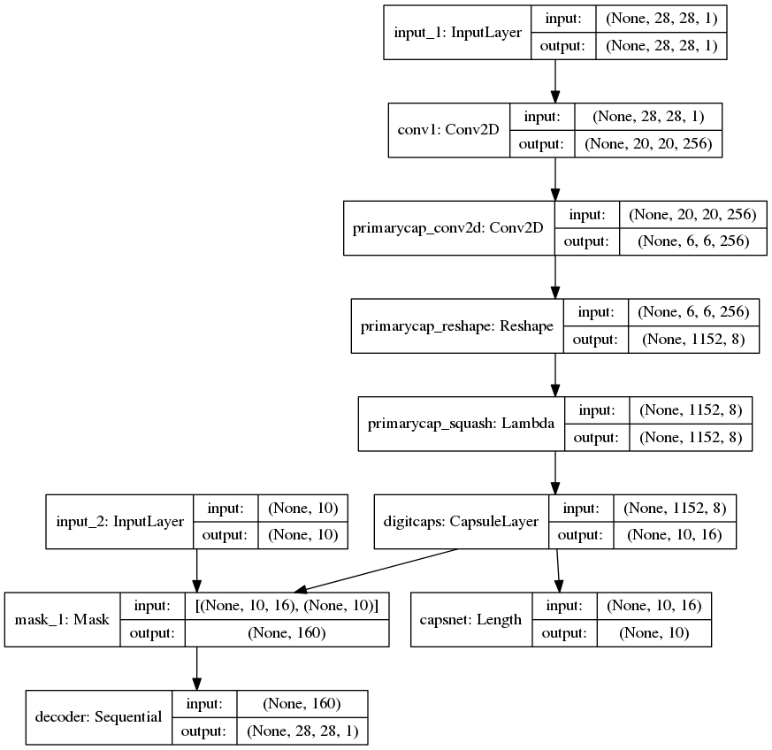
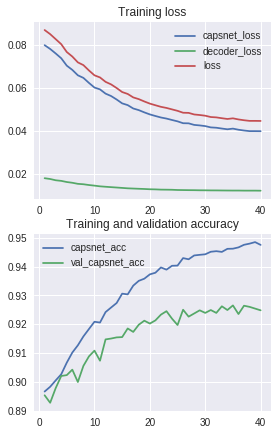

# CapsNet-Keras

Trained a Keras implementation CapsNet in the paper:   
[Sara Sabour, Nicholas Frosst, Geoffrey E Hinton. Dynamic Routing Between Capsules. NIPS 2017](https://arxiv.org/abs/1710.09829)   
on Fashion-MNIST dataset for 90 epochs.

The Keras model is built by XifengGuo [Repo](https://github.com/XifengGuo/CapsNet-Keras)

## Dataset
Fashion-MNIST is a dataset of Zalando's article images—consisting of a training set of 60,000 examples and a test set of 10,000 examples. Each example is a 28x28 grayscale image, associated with a label from 10 classes.

[Dataset Link](https://github.com/zalandoresearch/fashion-mnist)

Here's an example how the data looks (each class takes three-rows):

### Labels
Each training and test example is assigned to one of the following labels:

Label | Description
--- | ---
0 | T-shirt/top
1 | Trouser
2 | Pullover
3 | Dress
4 | Coat
5 | Sandal
6 | Shirt
7 | Sneaker
8 | Bag
9 | Ankle boot

# Results

After training for 90 epochs on Google Colab platform on
Fashion MNIST dataset:

Type | Validation Accuracy | Training Accuracy
--- | --- | ---
Best | 92.65% | 94.85%
Final | 92.48% | 94.75%

